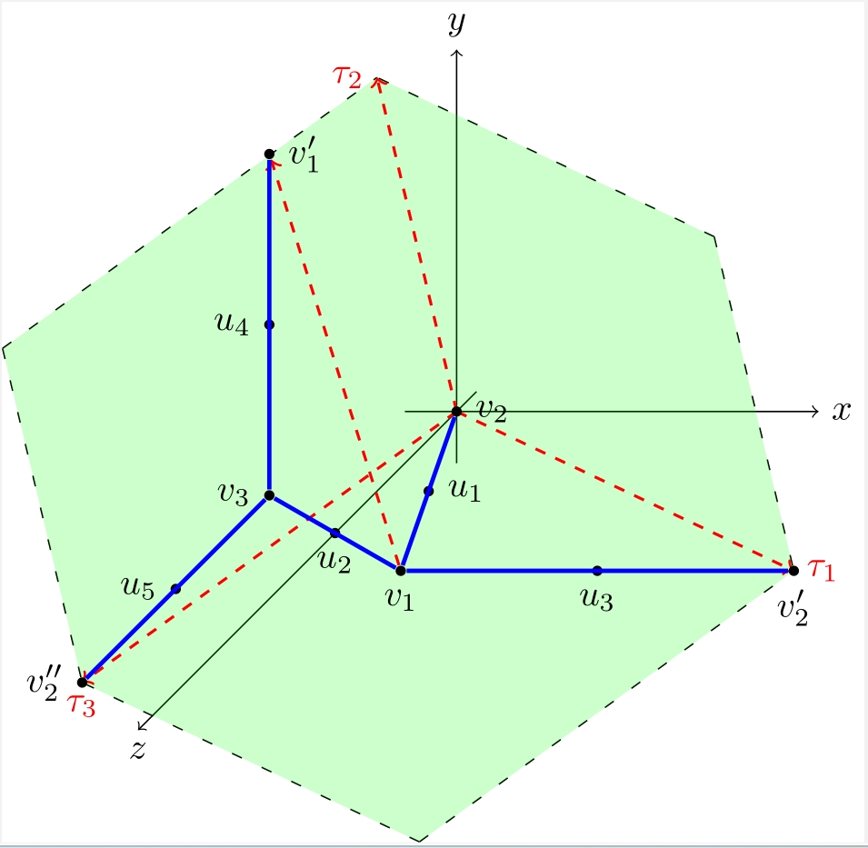
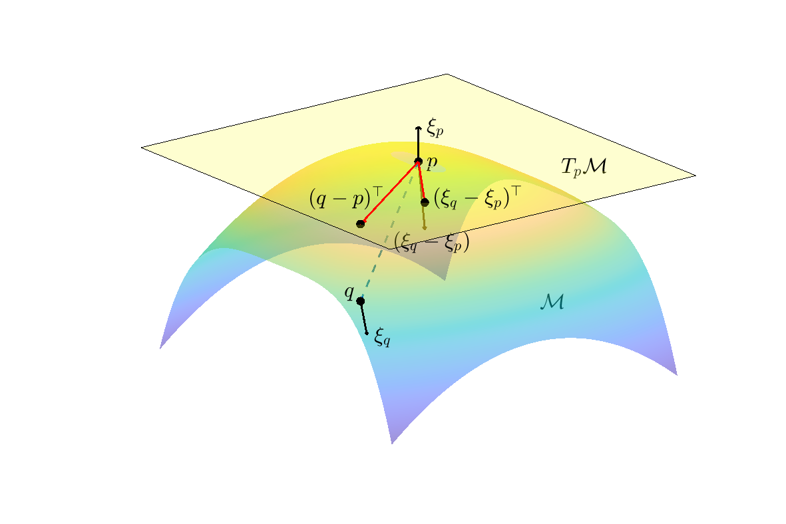

  [Github](https://github.com/YueqiCao)  

### **TropAJ**: Computing the tropical Abel--Jacobi transform of metric graphs

  
  

Metric graphs are in one-to-one correspondence with tropical curves in tropical algebraic geometry. The tropical Abel--Jacobi map provides an embedding of a metric graph into its associated flat torus known as the tropical Jacobian. The [TropAJ](https://github.com/YueqiCao/Tropical-Abel-Jacobi) repository contains codes to compute the tropical Abel--Jacobi transform of a metric graph, as well as the extrinsic tropical distances defined on the tropical Jacobian.

### **PD-Subsample**: Approximating the persistent homology of large datsets

  
  

  
Computing persistence diagrams (PDs) for massive point cloud datasets is prohibitive. To bypass this difficulty, classical bootstrapping method is adapted, where mean persistence measures and Fréchet means of PDs of subsample sets are regarded as approximations of the true PD of the original data. This [repository](https://github.com/YueqiCao/PD-subsample) contains codes to implement this algorithm.

### **WME**: Estimating the Weingarten map for submanifold point clouds  

  
  

WME (*Weingarten Map Estimator*) is an efficient algorithm to estimate the Weingarten map (or shape operator, or the second fundamental form in the literature of differential geometry) for submanifold point clouds in arbitrary dimension. The matlab code can be found in my github repository [WME](https://github.com/YueqiCao/WME.git). You can also download packages from the following

- [zip](https://github.com/YueqiCao/WME/archive/v1.1.zip)
- [tar.gz](https://github.com/YueqiCao/WME/archive/v1.1.tar.gz)

