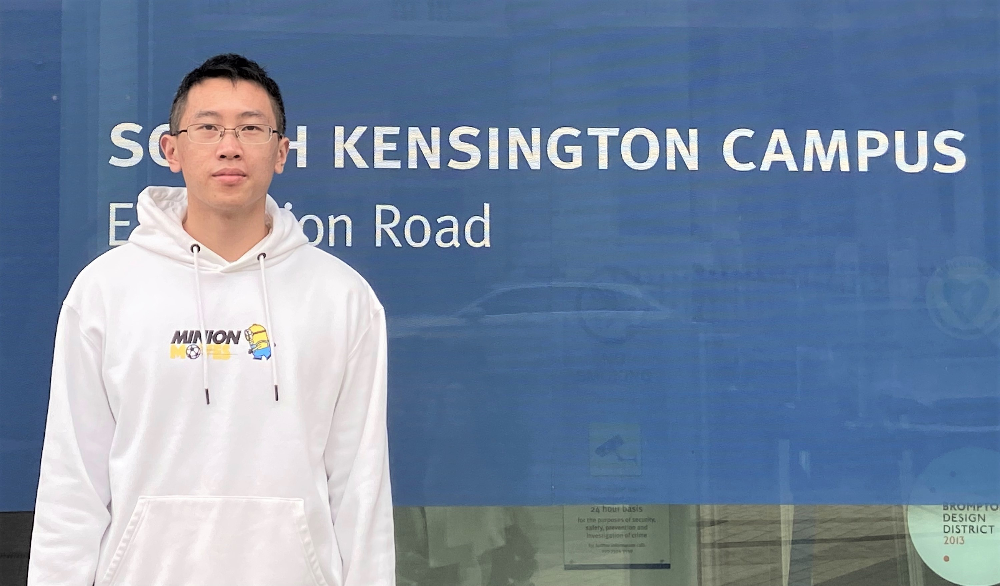

     

I’m a final-year PhD student at Department of Mathematics, Imperial College London, under the supervision of Dr. [Anthea Monod](https://sites.google.com/view/antheamonod/home), fully funded by the [President's Scholarship](https://www.imperial.ac.uk/study/fees-and-funding/postgraduate-doctoral/grants-scholarships/presidents-phd/).  

My current research focuses on the computation of tropical Abel-Jacobi transform of metric graphs. You can find my recent work [here](https://arxiv.org/abs/2504.11619). Previously I worked on statistical approximation of persistence diagrams of large datasets via subsampling. You can find this work [here](https://arxiv.org/abs/2204.09155).  

I obtained my master's and bachelor's degree at Beijing Institute of Technology under the supervision of Dr. [Huafei Sun](https://math.bit.edu.cn/szdw/azcpl/js/shf/index.htm). My master thesis is about the construction of the second fundamental form estimator on Euclidean submanifolds. You can find this work [here](https://link.springer.com/article/10.1007/s10994-021-05953-4). 

My research interests span across applied differential and algebraic geometry, topological data analysis, statistical methodology, and various real-world applications.    

**Contact**: y[dot]cao21[at]imperial[dot]ac[dot]uk

**Office**: Roderic Hill Building 317 

