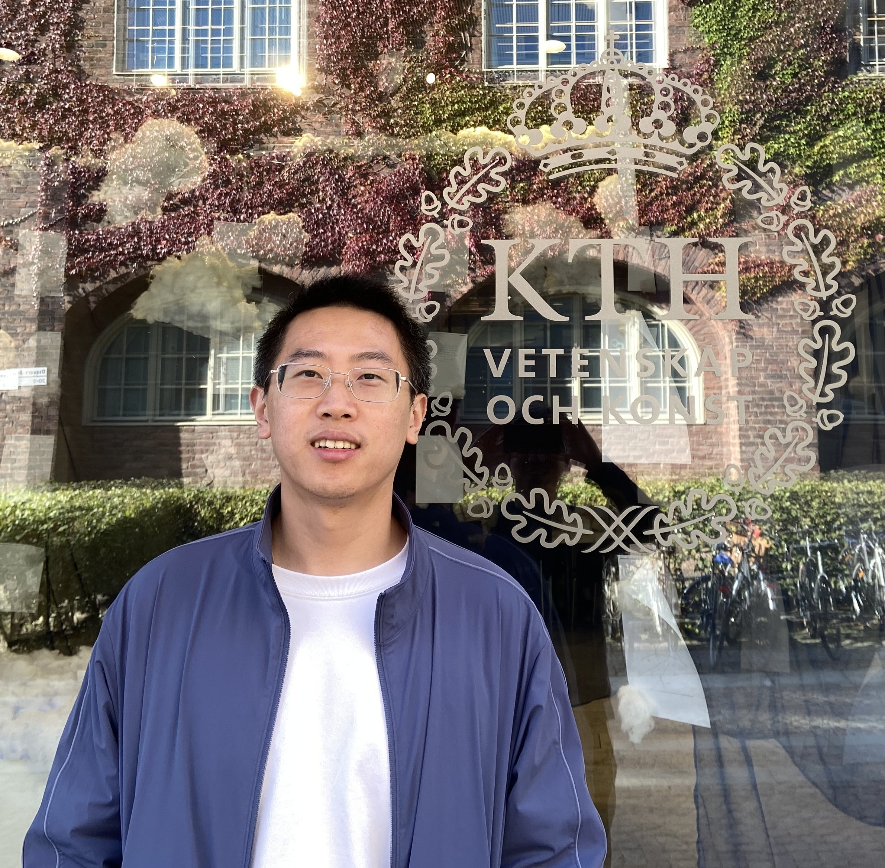

  
  

  
I'm a postdoc at Department of Mathematics, KTH Royal Institute of Technology, supervised by [Johan Karlsson](https://people.kth.se/~johan79/) and [Sandra Di Rocco](https://www.kth.se/profile/dirocco), funded by [Digital Futures Postdoctoral Fellowship](https://www.digitalfutures.kth.se/profile/yueqi-cao/).   
      I did my PhD in Mathematics at Imperial College London, supervised by [Anthea Monod](https://sites.google.com/view/antheamonod/home), funded by [President's Scholarship](https://www.imperial.ac.uk/study/fees-and-funding/postgraduate-doctoral/grants-scholarships/presidents-phd/). I'm affiliated with the [Erlangen AI Hub](https://erlangenhub.ox.ac.uk/).   
      My research interests span across applied differential and algebraic geometry, topological data analysis, statistical methodology, and various real-world applications.  
      

**Contact**: yueqic[at]kth[dot]se

**Office**: Lindstedtsvägen 25, Room 3611.

